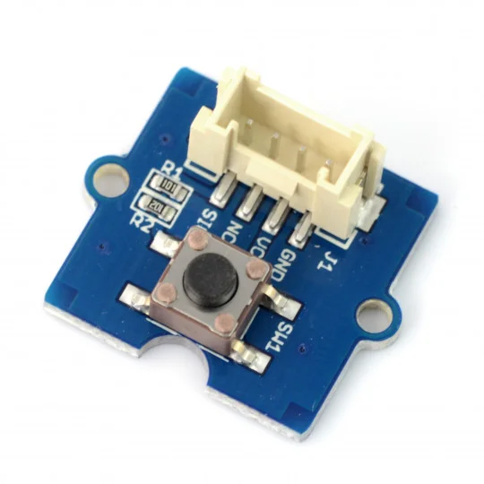
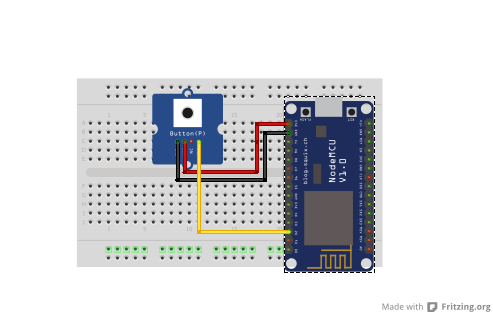

## Button

<table border="0" width="100%"><tr><td colspan=2 width="60%">seeed studio Grove </td>
<td rowspan=9 width="40%" align="right"></td></tr>
<tr><td>Voltage range</td><td><b>3.5V - 5V</b></td></tr>
<tr><td>Input type</td><td><b>Digital</b></td></tr>
<tr><td>Compatible</td><td><b>Arduino, Raspberry Pi, ESP8266</b></td></tr>
<tr><td>Operating temperature</td><td><b>-25°C to +70°C</b></td></tr>
<tr><td>Response time</td><td><b>1s</b></td></tr>
<tr><td>Price</td><td><b>< 41 Kč</b></td></tr></table>

* [Datasheet](./datasheet.pdf)

### Circuit
<p align="center"></p>

### MicroPython

```python
from machine import Pin
import time

button_pin = Pin(0, Pin.IN)
# pin D3
while True:

    button_state = button_pin.value()

    if button_state == 0:
        print("off")
    else: print("on")

    time.sleep(0.1)
```

### Notes
> Also found in Grove Creator Kit-
>
>https://wiki.seeedstudio.com/Grove-Creator-Kit-1/

### References
> https://wiki.seeedstudio.com/Grove-Button/
>
> https://botland.cz/grove-tlacitka-klavesnice-a-joysticky/11297-grove-button-modul-s-tlacitkem-5903351246446.html

### Zpracováno
- Václav Sontag
- Lucas Löffler