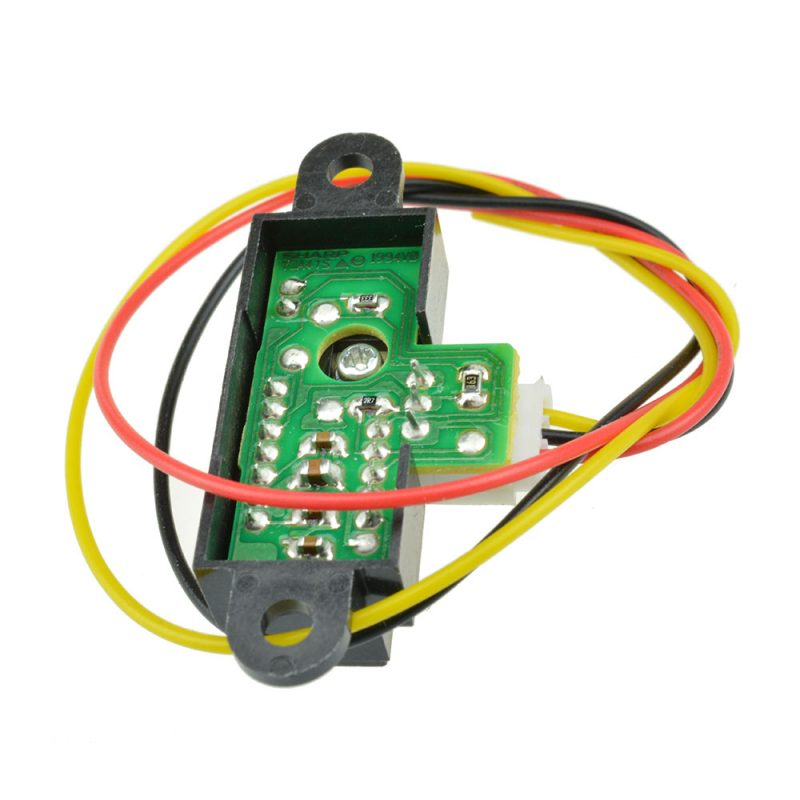
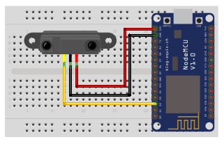

## Optický sensor

<table border="0" width="100%"><tr><td colspan=2 width="60%">GM Electronic</td>
<td rowspan=9 width="40%" align="right"></td></tr>
<tr><td>Voltage range</td><td><b>3.5V - 5V</b></td></tr>
<tr><td>Input type</td><td><b>Digital</b></td></tr>
<tr><td>Compatible</td><td><b>Arduino, Raspberry Pi, ESP8266</b></td></tr>
<tr><td>Operating temperature</td><td><b>-25°C to +70°C</b></td></tr>
<tr><td>Response time</td><td><b>1s</b></td></tr>
<tr><td>Price</td><td><b>< 41 Kč</b></td></tr></table>

* [Datasheet not found]()

### Circuit
<p align="center"></p>

### MicroPython

```python
import machine
import time

SENZOR_PIN = machine.Pin(4, machine.Pin.IN)

def read_sensor_value():
    return SENZOR_PIN.value()

while True:
    sensor_value = read_sensor_value()
    print("Hodnota senzoru: {}".format(sensor_value))
time_sleep(1)
```

### References
> 
>
> 

### Zpracováno
- Václav Sontag
- Lucas Löffler