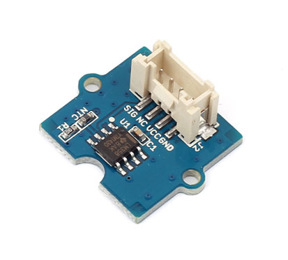

## Temperature sensor

<table border="0" width="100%"><tr><td colspan=2 width="60%">seeed studio Grove </td>
<td rowspan=9 width="40%" align="right"></td></tr>
<tr><td>Voltage range</td><td><b>3.3V - 5V</b></td></tr>
<tr><td>Input type</td><td><b>Digital</b></td></tr>
<tr><td>Compatible</td><td><b>Arduino, Raspberry Pi, ESP8266</b></td></tr>
<tr><td>Operating temperature</td><td><b>-40°C to +125°C</b></td></tr>
<tr><td>Accuracy</td><td><b>±1.5°C</b></td></tr>
<tr><td>Response time</td><td><b>1s</b></td></tr>
<tr><td>Price</td><td><b>< 86 Kč</b></td></tr></table>

* [Datasheet](./datasheet.pdf)

### Circuit
<p align="center"></p>

### MicroPython

```python
import dht
import machine
import time

dht_pin = machine.Pin(4)
dht_sensor = dht.DHT11(dht_pin)

while True:
    try:
        dht_sensor.measure()
        temperature = dht_sensor.temperature()

        print("Temperature: {:.2f} Degrees".format(temperature))
        time.sleep(3)

    except OSError as e:
        time.sleep(3)
```

### Notes
> Also found in Grove Creator Kit-
>
>https://wiki.seeedstudio.com/Grove-Creator-Kit-1/

### References
> https://wiki.seeedstudio.com/Grove-Temperature_Sensor_V1.2/
>
> https://seeeddoc.github.io/Grove-Temperature_Sensor_V1.2/

### Zpracováno
- Václav Sontag
- Lucas Löffler