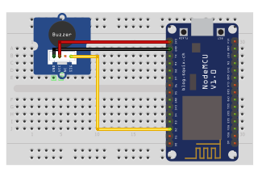

## Buzzer

<table border="0" width="100%"><tr><td colspan=2 width="60%">seeed studio Grove </td>
<td rowspan=9 width="40%" align="right"></td></tr>
<tr><td>Voltage range</td><td><b>3.3V - 5V</b></td></tr>
<tr><td>Input type</td><td><b>Digital</b></td></tr>
<tr><td>Sound Output</td><td><b>≥85dB</b></td></tr>
<tr><td>Resonant Frequency</td><td><b>2300Hz +/- 300Hz</b></td></tr>
<tr><td>Compatible</td><td><b>Arduino, Raspberry Pi, ESP8266</b></td></tr>
<tr><td>Operating temperature</td><td><b>-25°C to +70°C</b></td></tr>
<tr><td>Response time</td><td><b>1s</b></td></tr>
<tr><td>Price</td><td><b>< 41 Kč</b></td></tr></table>

* [Datasheet](./datasheet.pdf)

### Circuit
<p align="center"></p>

### MicroPython

```python
import machine
import time

BUZZER_PIN = machine.Pin(4, machine.Pin.OUT)

def buzzer_on():
    BUZZER_PIN.on()

def buzzer_off():
    BUZZER_PIN.off()

while True:
    buzzer_on()
    time.sleep(1)
    buzzer_off()
    time.sleep(1)

```

### Notes
> Also found in Grove Creator Kit-
>
>https://wiki.seeedstudio.com/Grove-Creator-Kit-1/

### References
> https://wiki.seeedstudio.com/Grove-Buzzer
>
> https://botland.cz/grove-zvukove-moduly/11298-grove-buzzer-modul-s-aktivnim-bzucakem-5903351246453.html

### Zpracováno
- Václav Sontag
- Lucas Löffler