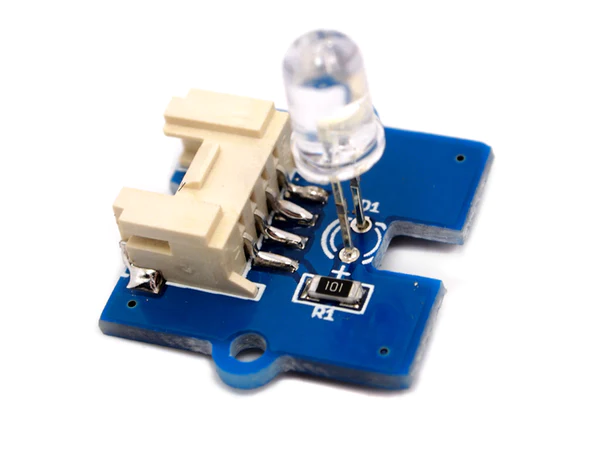
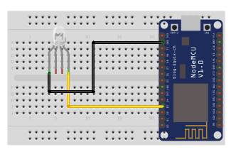

## Multi color flash LED v1.1

<table border="0" width="100%"><tr><td colspan=2 width="60%">seeed studio Grove </td>
<td rowspan=9 width="40%" align="right"></td></tr>
<tr><td>Voltage range</td><td><b>3.5V - 5V</b></td></tr>
<tr><td>Input type</td><td><b>Digital</b></td></tr>
<tr><td>Compatible</td><td><b>Arduino, Raspberry Pi, ESP8266</b></td></tr>
<tr><td>Operating temperature</td><td><b>-25°C to +70°C</b></td></tr>
<tr><td>Response time</td><td><b>1s</b></td></tr>
<tr><td>Price</td><td><b>< 41 Kč</b></td></tr></table>

* [Datasheet](./datasheet.pdf)

### Circuit
<p align="center"></p>

### MicroPython

```python
from machine import Pin, PWM
import time

red_pin = Pin(0, Pin.OUT)
green_pin = Pin(1, Pin.OUT)
blue_pin = Pin(2, Pin.OUT)

red_pwm = PWM(red_pin)
green_pwm = PWM(green_pin)
blue_pwm = PWM(blue_pin)

red_value = 0
green_value = 0
blue_value = 0

while True:

    for i in range(0, 512):
        red_value = i
        blue_value = 511 - i
        red_pwm.duty(red_value)
        blue_pwm.duty(blue_value)
        time.sleep(0.01)

    for i in range(0, 512):
        green_value = i
        red_value = 511 - i
        green_pwm.duty(green_value)
        red_pwm.duty(red_value)
        time.sleep(0.01)

    for i in range(0, 512):
        blue_value = i
        green_value = 511 - i
        blue_pwm.duty(blue_value)
        green_pwm.duty(green_value)
        time.sleep(0.01)
```

### Notes
> Also found in Grove Creator Kit-
>
>https://wiki.seeedstudio.com/Grove-Creator-Kit-1/

### References
> https://www.seeedstudio.com/Grove-Multi-Color-Flash-LED-5mm.html
>
> https://www.tme.eu/cz/details/seeed-104030014/rozsirujici-desky/seeed-studio/multi-color-flash-led-5mm/

### Zpracováno
- Václav Sontag
- Lucas Löffler