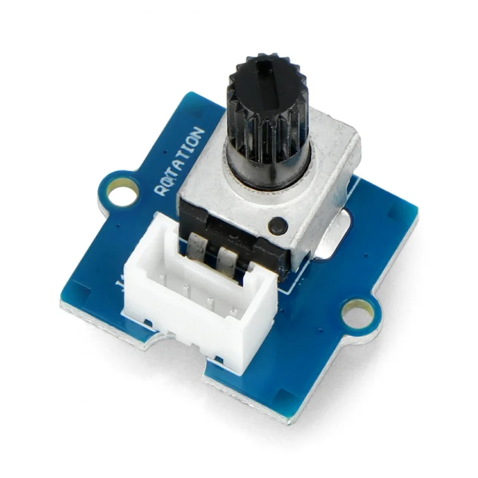
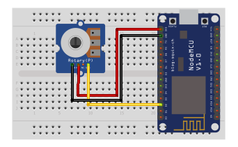

## Rotary angle sensor

<table border="0" width="100%"><tr><td colspan=2 width="60%">seeed studio Grove </td>
<td rowspan=9 width="40%" align="right"></td></tr>
<tr><td>Voltage range</td><td><b>4.75V - 5V</b></td></tr>
<tr><td>Input type</td><td><b>Digital</b></td></tr>
<tr><td>Compatible</td><td><b>Arduino, Raspberry Pi, ESP8266</b></td></tr>
<tr><td>Rotary angle</td><td><b>300°</b></td></tr>
<tr><td>Response time</td><td><b>1s</b></td></tr>
<tr><td>Price</td><td><b>< 88 Kč</b></td></tr></table>

* [Datasheet](./datasheet.pdf)

### Circuit
<p align="center"></p>

### MicroPython

```python
import machine
import time

sensor_pin = machine.Pin(4, machine.Pin.IN)

while True:

    sensor_value = sensor_pin()

    sensor_percentage = sensor_value

    print("Hodnota: {}%".format(sensor_percentage))

    time.sleep(0.1)
```

### Notes
>Also found in Grove Creator Kit-
>
>https://wiki.seeedstudio.com/Grove-Creator-Kit-1/

### References
> https://wiki.seeedstudio.com/Grove-Rotary_Angle_Sensor/
>
> https://www.tme.eu/cz/details/seeed-101020017/rozsirujici-desky/seeed-studio/rotary-angle-sensor/

### Zpracováno
- Václav Sontag
- Lucas Löffler