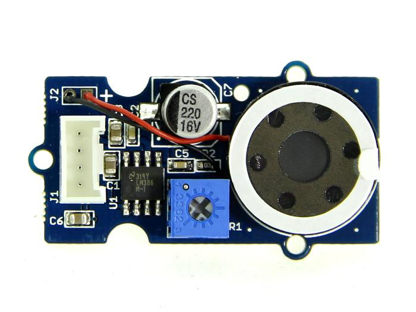
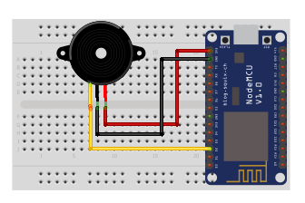

## Speaker

<table border="0" width="100%"><tr><td colspan=2 width="60%">seeed studio Grove </td>
<td rowspan=9 width="40%" align="right"></td></tr>
<tr><td>Voltage range</td><td><b>4V - 5.5V</b></td></tr>
<tr><td>Voltage Gain</td><td><b></b>46db</td></tr>
<tr><td>Band Width</td><td><b></b>20KHz</td></tr>
<tr><td>Compatible</td><td><b>Arduino, Raspberry Pi, ESP8266</b></td></tr>
<tr><td>Operating temperature</td><td><b>-25°C to +70°C</b></td></tr>
<tr><td>Response time</td><td><b>1s</b></td></tr>
<tr><td>Price</td><td><b>< 249 Kč</b></td></tr></table>

* [Datasheet](./datasheet.pdf)

### Circuit
<p align="center"></p>

### MicroPython

```python
import machine
import time

SPEAKER_PIN = machine.Pin(4, machine.Pin.OUT)

def play_tone(frequency, duration):
    period_us = int(1000000 / frequency)
    half_period_us = int(period_us / 2)
    cycles = int(duration * frequency)

    for _ in range(cycles):
        SPEAKER_PIN.on()
        time.sleep_us(half_period_us)
        SPEAKER_PIN.off()
        time.sleep_us(half_period_us)

super_mario_theme = [
    659, 659, 0, 659, 0, 523, 659, 0, 784, 0, 392, 0, 523, 0, 392, 0,
    330, 0, 440, 0, 494, 0, 466, 0, 440, 0, 392, 0, 659, 0, 784, 0,
    880, 0, 698, 0, 784, 0, 659, 0, 523, 0, 587, 0, 494, 0, 523, 0,
    392, 0, 330, 0, 440, 0, 494, 0, 466, 0, 440, 0, 392, 0, 659, 0,
    784, 0, 880, 0, 698, 0, 784, 0, 659, 0, 523, 0, 587, 0, 494, 0
]

super_mario_durations = [
    0.2, 0.2, 0.2, 0.2, 0.2, 0.2, 0.4, 0.2, 0.2, 0.2, 0.2, 0.2, 0.2, 0.2, 0.4, 0.2,
    0.2, 0.2, 0.2, 0.2, 0.2, 0.2, 0.2, 0.2, 0.2, 0.2, 0.2, 0.2, 0.4, 0.2, 0.2, 0.2,
    0.2, 0.2, 0.2, 0.2, 0.2, 0.2, 0.2, 0.2, 0.2, 0.2, 0.2, 0.2, 0.2, 0.2, 0.2, 0.2,
    0.2, 0.2, 0.2, 0.2, 0.2, 0.2, 0.2, 0.2, 0.2, 0.2, 0.4, 0.2, 0.2, 0.2, 0.2, 0.2,
    0.2
]
```

### Notes
>Also found in Grove Creator Kit-
>
>https://wiki.seeedstudio.com/Grove-Creator-Kit-1/

### References
> https://wiki.seeedstudio.com/Grove-Speaker
>
> https://www.cytron.io/p-grove-speaker

### Zpracováno
- Václav Sontag
- Lucas Löffler