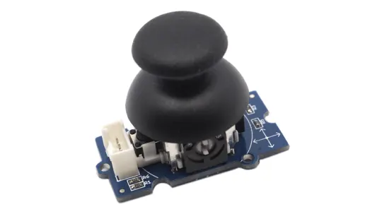
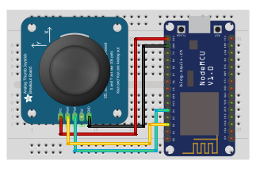

## Thumb joystick

<table border="0" width="100%"><tr><td colspan=2 width="60%">seeed studio Grove </td>
<td rowspan=9 width="40%" align="right"></td></tr>
<tr><td>Voltage range</td><td><b>4.75V - 5.25V</b></td></tr>
<tr><td>Input type</td><td><b>Digital</b></td></tr>
<tr><td>Compatible</td><td><b>Arduino, Raspberry Pi, ESP8266</b></td></tr>
<tr><td>Response time</td><td><b>1s</b></td></tr>
<tr><td>Price</td><td><b>< 182 Kč</b></td></tr></table>

* [Datasheet](./datasheet.pdf)

### Circuit
<p align="center"></p>

### MicroPython

```python
import machine
import time

x_pin = machine.Pin(4, machine.Pin.IN) # X pin D2
y_pin = machine.Pin(2, machine.Pin.IN) # Y pin D4

def read_joystick():
    x_state = x_pin.value()
    y_state = y_pin.value()
    return x_state, y_state

while True:
    x, y = read_joystick()
    print("X-axis state:", x)
    time.sleep(1)
    print("Y-axis state:", y)
    time.sleep(1)
    print("------------------")
    time.sleep(1)
```

### Notes
> Also found in Grove Creator Kit-
>
>https://wiki.seeedstudio.com/Grove-Creator-Kit-1/

### References
> https://wiki.seeedstudio.com/Grove-Thumb_Joystick/
>
> https://seeeddoc.github.io/Grove-Thumb_Joystick/

### Zpracováno
- Václav Sontag
- Lucas Löffler