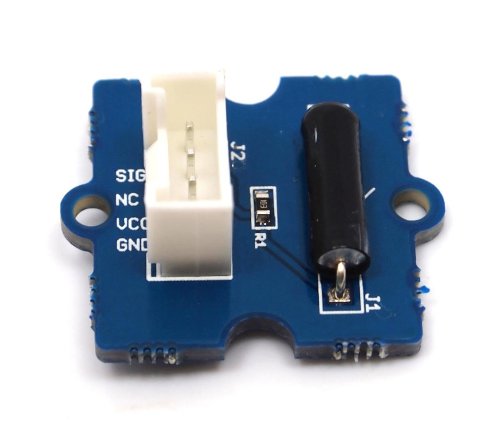
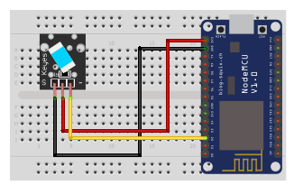

## Tilt switch

<table border="0" width="100%"><tr><td colspan=2 width="60%">seeed studio Grove </td>
<td rowspan=9 width="40%" align="right"></td></tr>
<tr><td>Voltage range</td><td><b>3V - 5.25V</b></td></tr>
<tr><td>Input type</td><td><b>Digital</b></td></tr>
<tr><td>Compatible</td><td><b>Arduino, Raspberry Pi, ESP8266</b></td></tr>
<tr><td>Connecting Angle</td><td><b>10° ~170°</b></td></tr>
<tr><td>Disconnect angle</td><td><b>190° ~350°</b></td></tr>
<tr><td>Electrical Life</td><td><b>100,000 Cycle</b></td></tr>
<tr><td>Price</td><td><b>< 70 Kč</b></td></tr></table>

* [Datasheet](./datasheet.pdf)

### Circuit
<p align="center"></p>

### MicroPython

```python
import machine
import time

switch_pin = machine.Pin(4, machine.Pin.IN)

while True:
    if switch_pin.value() == 1:
        print("on")
       
    else:
        print("off")
    time.sleep(0.1)
```

### Notes
> Also found in Grove Creator Kit-
>
>https://wiki.seeedstudio.com/Grove-Creator-Kit-1/

### References
> https://wiki.seeedstudio.com/Grove-Tilt_Switch/
>
> https://seeeddoc.github.io/Grove-Tilt_Switch/

### Zpracováno
- Václav Sontag
- Lucas Löffler