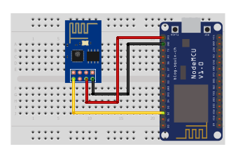

## UART WiFi v2

<table border="0" width="100%"><tr><td colspan=2 width="60%">seeed studio Grove </td>
<td rowspan=9 width="40%" align="right"></td></tr>
<tr><td>Voltage range</td><td><b>3V - 5V</b></td></tr>
<tr><td>Input type</td><td><b>Digital</b></td></tr>
<tr><td>Compatible</td><td><b>Arduino, Raspberry Pi, ESP8266</b></td></tr>
<tr><td>Baud Rate</td><td><b>115200</b></td></tr>
<tr><td>Response time</td><td><b>2ms</b></td></tr>
<tr><td>Price</td><td><b>< 41 Kč</b></td></tr></table>

* [Datasheet](./datasheet.pdf)

### Circuit
<p align="center"></p>

### MicroPython

```python
import machine
import time
import network

uart = machine.UART(0, 115200) 
wifi = network.WLAN(network.STA_IF)
wifi.active(True)
wifi.connect("Xiaomi 11T", "12345678")
time.sleep(5)
if wifi.isconnected():
    print("Připojeno k Wi-Fi síti")
else:
    print("Chyba při připojování k Wi-Fi síti")
while True:
    uart.write(b"Hello, World!\n")
    time.sleep(1)
```

### Notes
> Also found in Grove Creator Kit-
>
>https://wiki.seeedstudio.com/Grove-Creator-Kit-1/

### References
> https://wiki.seeedstudio.com/Grove-UART_Wifi_V2/
>
> https://seeeddoc.github.io/Grove-UART_WiFi/

### Zpracováno
- Václav Sontag
- Lucas Löffler