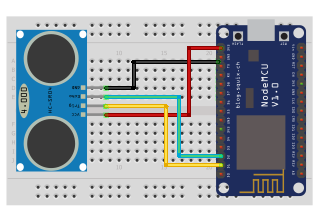

## Ultrazvukový senzor

<table border="0" width="100%"><tr><td colspan=2 width="60%">seeed studio Grove </td>
<td rowspan=9 width="40%" align="right"></td></tr>
<tr><td>Voltage range</td><td><b>3.2V - 5.2V</b></td></tr>
<tr><td>Input type</td><td><b>Digital</b></td></tr>
<tr><td>Compatible</td><td><b>Arduino, Raspberry Pi, ESP8266</b></td></tr>
<tr><td>Ultrasonic frequency</td><td><b>40kHz</b></td></tr>
<tr><td>Response time</td><td><b>1s</b></td></tr>
<tr><td>Price</td><td><b>< 120 Kč</b></td></tr></table>

* [Datasheet](./datasheet.pdf)

### Circuit
<p align="center"></p>

### MicroPython

```python
from machine import Pin
import time

trigger_pin = Pin(5, Pin.OUT) # trigger D1
echo_pin = Pin(4, Pin.IN) #echo D2

def measure_distance():

    trigger_pin.on()
    time.sleep_us(10)
    trigger_pin.off()

    while echo_pin.value() == 0:
        pulse_start = time.ticks_us()

    while echo_pin.value() == 1:
        pulse_end = time.ticks_us()
    pulse_duration = pulse_end - pulse_start
    distance = pulse_duration * 0.0343 / 2 # Převod času na vzdálenost

    return distance

while True:
    distance = measure_distance()
    print("distance:", distance, "cm")
    time.sleep(1)
```

### Notes
> Also found in Grove Creator Kit 30, 40 pcs-
>
>https://wiki.seeedstudio.com/Grove-Creator-Kit-1/

### References
> https://rpishop.cz/moduly/2188-grove-ultrazvukovy-senzor-vzdalenosti.html
>
> https://botland.cz/grove-senzory-vzdalenosti-a-pohybu/11360-grove-ultrazvukovy-senzor-vzdalenosti-3-350-cm-5903351247177.html

### Zpracováno
- Václav Sontag
- Lucas Löffler