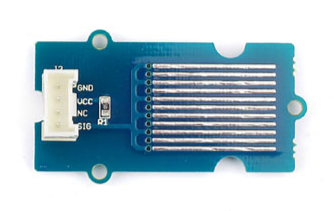
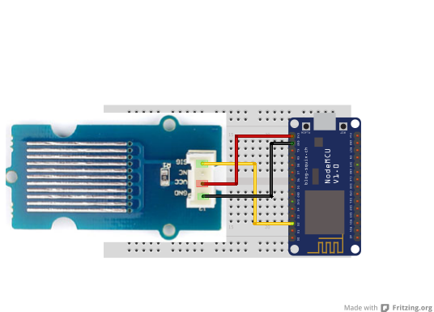

## Water sensor

<table border="0" width="100%"><tr><td colspan=2 width="60%">seeed studio Grove </td>
<td rowspan=9 width="40%" align="right"></td></tr>
<tr><td>Voltage range</td><td><b>4.75V - 5.25V</b></td></tr>
<tr><td>Input type</td><td><b>Digital</b></td></tr>
<tr><td>Compatible</td><td><b>Arduino, Raspberry Pi, ESP8266</b></td></tr>
<tr><td>Operating temperature</td><td><b>10°C to 30°C</b></td></tr>
<tr><td>Working Humidity (without condensation)</td><td><b>10% to 90%</b></td></tr>
<tr><td>Response time</td><td><b>1s</b></td></tr>
<tr><td>Price</td><td><b>< 41 Kč</b></td></tr></table>

* [Datasheet not found]()

### Circuit
<p align="center"></p>

### MicroPython

```python
import machine
import time

water_pin = machine.Pin(4, machine.Pin.IN)

while True:

    water_value = water_pin.value()

    if water_value:
        print("Soil is dry")
    else:
        print("Soil is wet")

    time.sleep(0.1)
```

### Notes
> Also found in Grove Creator Kit-
>
>https://wiki.seeedstudio.com/Grove-Creator-Kit-1/

### References
> https://wiki.seeedstudio.com/Grove-Water_Sensor/
>
> https://seeeddoc.github.io/Grove-Water_Sensor/

### Zpracováno
- Václav Sontag
- Lucas Löffler