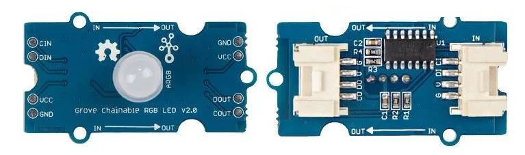

## Chainable RGB LED v2.0

<table border="0" width="100%"><tr><td colspan=2 width="60%">seeed studio Grove </td>
<td rowspan=9 width="40%" align="right"></td></tr>
<tr><td>Voltage range</td><td><b>5V</b></td></tr>
<tr><td>Input type</td><td><b>Digital</b></td></tr>
<tr><td>Compatible</td><td><b>Arduino, Raspberry Pi, ESP8266</b></td></tr>
<tr><td>Operating temperature</td><td><b>-40°C to +85°C</b></td></tr>
<tr><td>Max chained LED quantity</td><td><b>1024</b></td></tr>
<tr><td>Response time</td><td><b>1s</b></td></tr>
<tr><td>Price</td><td><b>< 92 Kč</b></td></tr></table>

* [Datasheet](./datasheet.pdf)

### Circuit
<p align="center"></p>

### MicroPython

```python
import machine
import neopixel

num_leds = 3  # Number of LEDs in the chain
in_pin = 4    # Input pin (DIN)
out_pin = 5   # Output pin (DOUT)

np = neopixel.NeoPixel(machine.Pin(in_pin), num_leds)

def set_led_color(red, green, blue):
    for i in range(num_leds):
        np[i] = (red, green, blue)
    np.write()

# color red
set_led_color(255,0, 255)
```

### Notes
> Also found in Grove Creator Kit-
>
>https://wiki.seeedstudio.com/Grove-Creator-Kit-1/

### References
> https://wiki.seeedstudio.com/Grove-Chainable_RGB_LED/
>
> https://robotools.in/shop/electronic-modules/led-module/seeedstudio-grove-chainable-rgb-led-v2-0/

### Zpracováno
- Václav Sontag
- Lucas Löffler