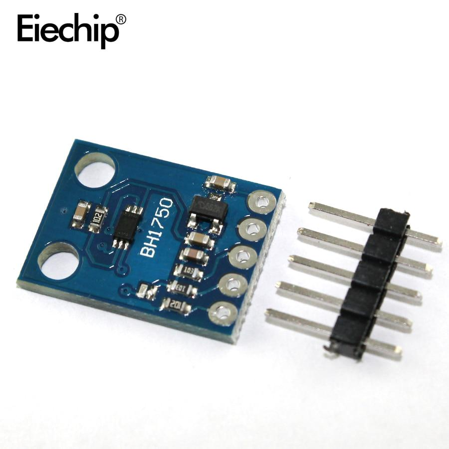
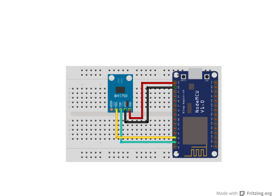

## Intenzita osvětlení

<table border="0" width="100%"><tr><td colspan=2 width="60%"></td>
<td rowspan=9 width="40%" align="right"></td></tr>
<tr><td>Voltage range</td><td><b>3.3V - 5V</b></td></tr>
<tr><td>Compatible</td><td><b>Arduino, Raspberry Pi, ESP8266</b></td></tr>
<tr><td>Response time</td><td><b>2ms</b></td></tr>
<tr><td>Measuring range</td><td><b>0 - 65535lux</b></td></tr></table>
<tr><td>Price</td><td><b>< 67 Kč</b></td></tr></table>

* [Datasheet not found]()

### Circuit
<p align="center"></p>

### MicroPython

```python
from machine import Pin
import time

light_pin = Pin(4, Pin.IN) #SDA to D2

def read_light_intensity():
    light_intensity = light_pin.value()
    return light_intensity

while True:
    intensity = read_light_intensity()
    if intensity == 0:
        print("Light detected")
    else:
        print("Light not detected")
    time.sleep(1)
```

### References
> https://www.laskakit.cz/snimac-intenzity-osvetleni-bh1750/
>
> https://rpishop.cz/svetlo/2435-modul-intenzity-svetla-gy-302-bh1750.html

### Zpracováno
- Václav Sontag
- Lucas Löffler