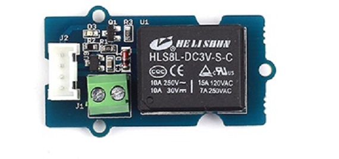
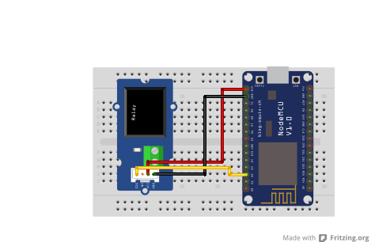

## Relay

<table border="0" width="100%"><tr><td colspan=2 width="60%">seeed studio Grove </td>
<td rowspan=9 width="40%" align="right"></td></tr>
<tr><td>Voltage range</td><td><b>3.3V - 5V</b></td></tr>
<tr><td>Input type</td><td><b>Digital</b></td></tr>
<tr><td>Compatible</td><td><b>Arduino, Raspberry Pi, ESP8266</b></td></tr>
<tr><td>Response time</td><td><b>1s</b></td></tr>
<tr><td>Relay life</td><td><b>100,000 Cycle</b></td></tr>
<tr><td>Max Switching Current</td><td><b>5A</td></tr>
<tr><td>Price</td><td><b>< 84 Kč</b></td></tr></table>

* [Datasheet](./datasheet.pdf)

### Circuit
<p align="center"></p>

### MicroPython

```python
import machine
import time

relay_pin = machine.Pin(4, machine.Pin.OUT) 


def turn_relay_on():
    relay_pin.value(1) 

def turn_relay_off():
    relay_pin.value(0)

turn_relay_on()
time.sleep(2) 
turn_relay_off() 
```

### Notes
> Also found in Grove Creator Kit-
>
> https://wiki.seeedstudio.com/Grove-Creator-Kit-1/

### References
> https://wiki.seeedstudio.com/Grove-Relay/
>
> https://seeeddoc.github.io/Grove-Relay/

### Zpracováno
- Václav Sontag
- Lucas Löffler