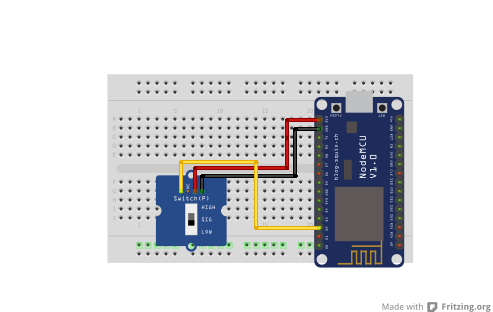

## Switch (P)

<table border="0" width="100%"><tr><td colspan=2 width="60%">seeed studio Grove </td>
<td rowspan=9 width="40%" align="right"></td></tr>
<tr><td>Voltage range</td><td><b>3.3V - 5V</b></td></tr>
<tr><td>Electrical Life</td><td><b>10,000 cycles</b></td></tr>
<tr><td>Operation Force</td><td><b>200 ± 50gf</b></td></tr>
<tr><td>Compatible</td><td><b>Arduino, Raspberry Pi, ESP8266</b></td></tr>
<tr><td>Operating temperature</td><td><b>-20°C to +80°C</b></td></tr>
<tr><td>Response time</td><td><b>1s</b></td></tr>
<tr><td>Price</td><td><b> < 93 Kč</b></td></tr></table>

* [Datasheet not found]()

### Circuit
<p align="center"></p>

### MicroPython

```python
from machine import Pin
import time

switch_pin = Pin(0, Pin.IN)

while True:

    switch_state = switch_pin.value()

    if switch_state == 0:
        print("on")
    else:
        print("off")

    time.sleep(0.1)
#pinout D3
```

### Notes
> Also found in Grove Creator Kit-
>
>https://wiki.seeedstudio.com/Grove-Creator-Kit-1/

### References
> https://wiki.seeedstudio.com/Grove-Switch-P/

### Zpracováno
- Václav Sontag
- Lucas Löffler