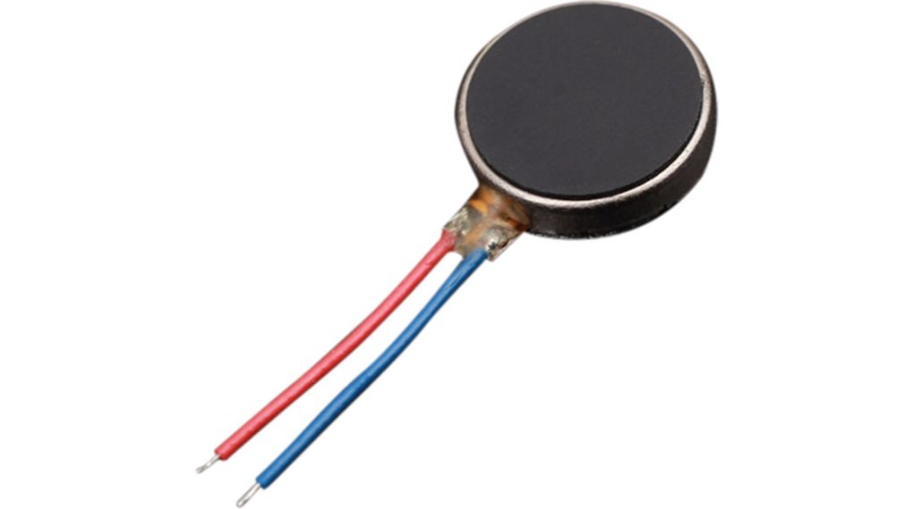
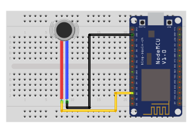

## Vibrační mini motor

<table border="0" width="100%"><tr><td colspan=2 width="60%">seeed studio Grove </td>
<td rowspan=9 width="40%" align="right"></td></tr>
<tr><td>Voltage range</td><td><b>1.5V - 3V</b></td></tr>
<tr><td>Input type</td><td><b>Digital</b></td></tr>
<tr><td>Compatible</td><td><b>Arduino, Raspberry Pi, ESP8266</b></td></tr>
<tr><td>Weight</td><td><b>0.7 grams</b></td></tr>
<tr><td>Response time</td><td><b>1s</b></td></tr>
<tr><td>Price</td><td><b>< 19 Kč</b></td></tr></table>

* [Datasheet](./datasheet.pdf)

### Circuit
<p align="center"></p>

### MicroPython

```python
import machine
import time

motor_pin = machine.Pin(4, machine.Pin.OUT)

def turn_on_motor():
    motor_pin.on()

def turn_off_motor():
    motor_pin.off()

while True:
    turn_on_motor()
    time.sleep(1)
    turn_off_motor()
    time.sleep(1)
```

### Notes
> Also found in Grove Creator Kit-
>
>https://wiki.seeedstudio.com/Grove-Creator-Kit-1/

### References
> https://www.postavrobota.cz/Mini-vibracni-motor-d1101.htm
>
> https://www.laskakit.cz/mini-vibracni-motor-10x3-4mm-5v/

### Zpracováno
- Václav Sontag
- Lucas Löffler