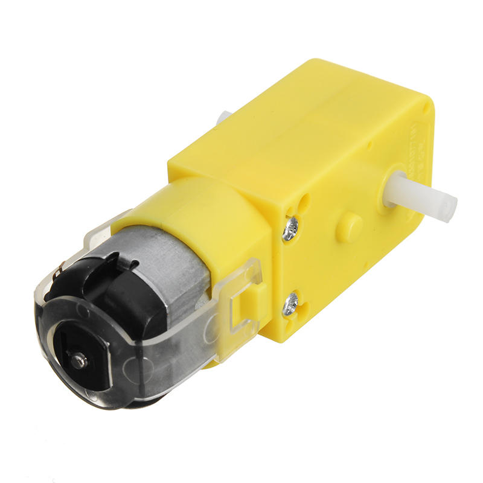
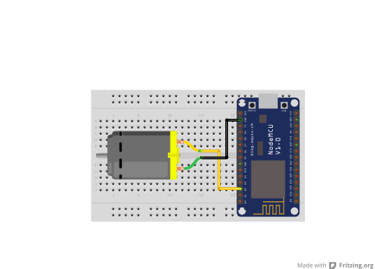

## Water sensor

<table border="0" width="100%"><tr><td colspan=2 width="60%">seeed studio Grove </td>
<td rowspan=9 width="40%" align="right"></td></tr>
<tr><td>Voltage range</td><td><b>3V - 6V</b></td></tr>
<tr><td>Input type</td><td><b>Digital</b></td></tr>
<tr><td>Compatible</td><td><b>Arduino, Raspberry Pi, ESP8266</b></td></tr>
<tr><td>RPM</td><td><b>100-240</b></td></tr>
<tr><td>Speed m/minute</td><td><b>20-48</b></td></tr>
<tr><td>Price</td><td><b>< 175 Kč</b></td></tr></table>

* [Datasheet not found]()

### Circuit
<p align="center"></p>

### MicroPython

```python
import machine
import time

motor_pin = machine.Pin(4, machine.Pin.OUT)

def turn_on_motor():
    motor_pin.on()

def turn_off_motor():
    motor_pin.off()

while True:
    turn_on_motor()
    time.sleep(1)
    turn_off_motor()
    time.sleep(1)
```

### References
> https://dratek.cz/arduino/972-kolo-s-prevodovanym-motorem.html?gclid=EAIaIQobChMIp6ic8oCQ_wIV6wcGAB3-twajEAQYAiABEgI-gvD_BwE
>
> 

### Zpracováno
- Václav Sontag
- Lucas Löffler