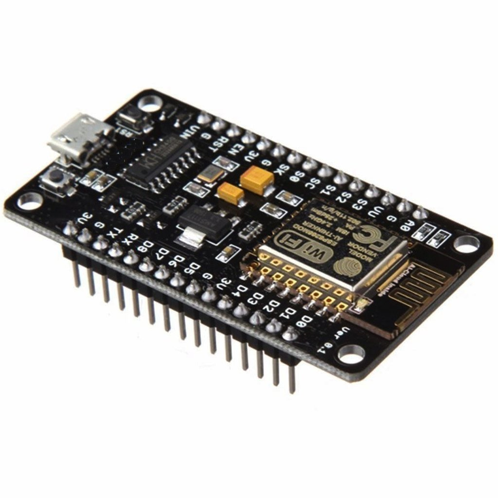
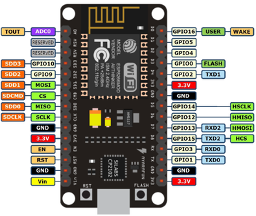

## NodeMCU ESP8266

<table border="0" width="100%"><tr><td colspan=2 width="60%">Low-cost Wi-Fi microchip</td>
<td rowspan=12 width="40%" align="right"><br /><br /></td></tr>
<tr><td>Processor</td><td><b>L106 32-bit, 80Mhz</b></td></tr>
<tr><td>User-data RAM</td><td><b>80 kB</b></td></tr>
<tr><td>External QSPI flash</td><td><b>up to 16 MB supported</b></td></tr>
<tr><td>Price</td><td><b>< 300 Kč</b></td></tr>
<tr><td colspan=2>IEEE 802.11 b/g/n Wi-Fi (WEP or WPA/WPA2 auth, or open nets)</td></tr>
<tr><td colspan=2>16 GPIO pins</td></tr>
<tr><td colspan=2>SPI (Serial Peripheral Interface)</td></tr>
<tr><td colspan=2>I2C (software implementation)</td></tr>
<tr><td colspan=2>I2S interfaces with DMA</td></tr>
<tr><td colspan=2>UART on dedicated pins, plus a transmit-only UART (GPIO2)</td></tr>
<tr><td colspan=2>10-bit ADC</td></tr></table>

* [Datasheet](https://www.espressif.com/sites/default/files/documentation/0a-esp8266ex_datasheet_en.pdf)

### Firmware

Conda env with **esptool** and **mpfshell**:
 ```shell
 $ conda env create -f env-esp-py36.yml
 $ conda activate env-esp-py36
 ```

Erase flash:
```shell
 $ sudo esptool.py --port /dev/ttyUSB0 erase_flash
```

Get the latest Micropython binary from: http://micropython.org/download#esp8266

Deploy the firmware:
```shell
 $ sudo esptool.py --port /dev/ttyUSB0 --baud 460800 write_flash --flash_size=detect 0 <your_downloaded_binary>.bin
```

### MpfShell

Run mpfshell and connect to your ESP:
```shell
 $ sudo python -m mp.mpfshell
 mpfs [/]> open ttyUSB0
```

### Wifi


### MQTT


### References

> https://docs.micropython.org/en/latest/esp8266/tutorial/intro.html#intro