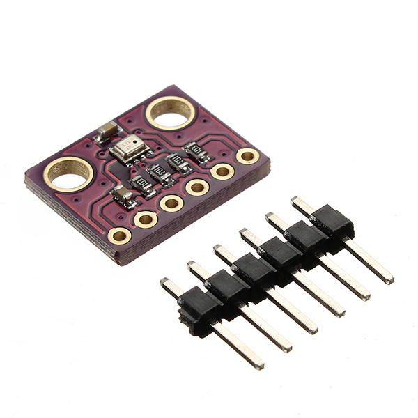
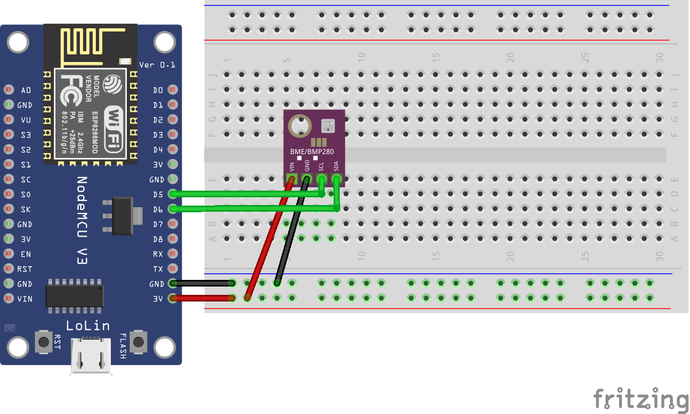

## Sensor HW-611 E/P 280 (BME/BMP 280)

<table border="0" width="100%"><tr><td colspan=2 width="60%">Barometric pressure, temperature, humidity (only E version)</td>
<td rowspan=9 width="40%" align="right"></td></tr>
<tr><td>Voltage range</td><td><b>1.71V - 3.6V</b></td></tr>
<tr><td>Current consumption</td><td><b>BMP: 2.8 &microA / BME: 3.6 &microA</b></td></tr>
<tr><td>Operating temperature</td><td><b>-40°C to +85°C</b></td></tr>
<tr><td>Operating relative humidity</td><td><b>0% to 100%</b></td></tr>
<tr><td>Operating barometric pressure</td><td><b>300hPa to 1100hPa</b></td></tr>
<tr><td>Response time</td><td><b>1s</b></td></tr>
<tr><td>Price</td><td><b>< 300 Kč</b></td></tr></table>

* [Datasheet](./datasheet.pdf)

### Circuit
<p align="center"></p>

### MicroPython

```python
from machine import Pin, I2C
from bme280 import BME280

i2c_bme = I2C(scl=Pin(14, Pin.IN), sda=Pin(12, Pin.IN))
bme = BME280(i2c=i2c_bme)

print('Pressure: {}, Temperature: {}'.format(bme.pressure, bme.temperature))
```

### Notes
> E version: Barometric pressure, temperature, relative humidity
>
> P version: Barometric pressure, temperature

> Alternatively: [BM | GY-BM | HW-611] E/P 280

### References
> https://randomnerdtutorials.com/micropython-bme280-esp32-esp8266/

> http://www.embeddedadventures.com/datasheets/BME280.pdf