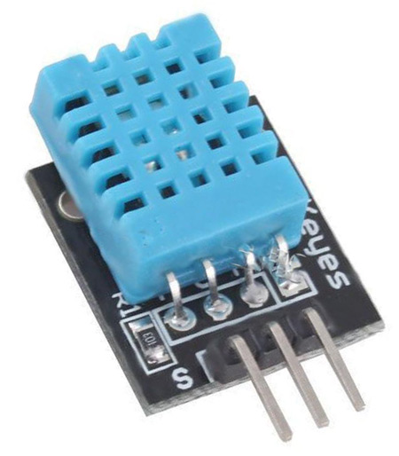

## Sensor DHT 11

<table border="0" width="100%"><tr><td colspan=2 width="60%">Temperature and humidity</td>
<td rowspan=7 width="40%" align="right"></td></tr>
<tr><td>Voltage range</td><td><b>3.0V - 5.5V</b></td></tr>
<tr><td>Operating temperature range</td><td><b>0°C to +50°C</b></td></tr>
<tr><td>Temperature accuracy</td><td><b>&plusmn 2.0°C</b></td></tr>
<tr><td>Operating relative humidity range</td><td><b>20% to 90%</b></td></tr>
<tr><td>Relative humidity accuracy</td><td><b>&plusmn 5.0%</b></td></tr>
<tr><td>Dimensions</td><td><b>23x12x5 mm</b></td></tr>
<tr><td>Price</td><td><b>< 100 Kč</b></td></tr></table>

* [Datasheet](./datasheet.pdf)

### Circuit
<p align="center"></p>

### MicroPython

```python

```

### References
> https://www.mouser.com/datasheet/2/758/DHT11-Technical-Data-Sheet-Translated-Version-1143054.pdf