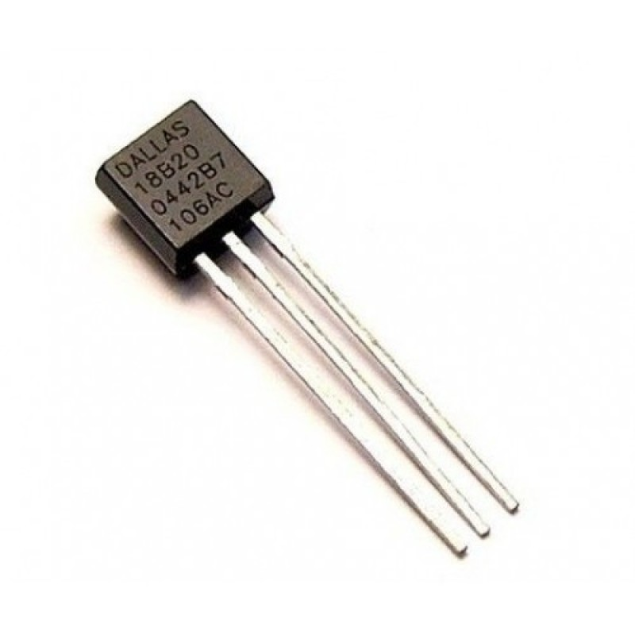
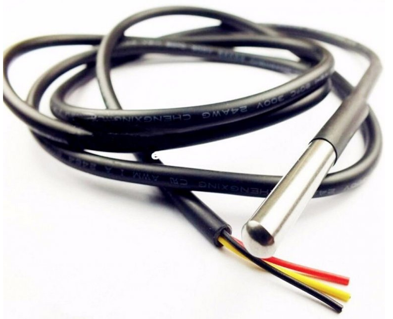
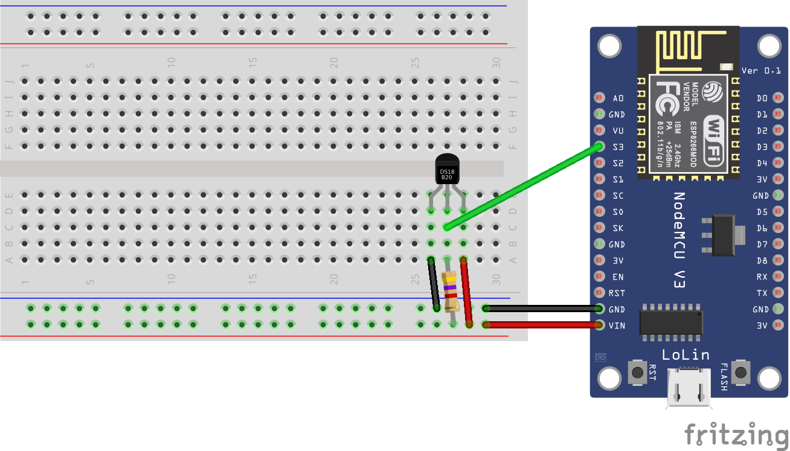

## Sensor DS18B20

<table border="0" width="100%"><tr><td colspan=2 width="60%">Temperature (2 versions: basic/water resistant)</td>
<td rowspan=7 width="40%" align="right"></td></tr>
<tr><td>Voltage range</td><td><b>3.0V - 5.5V</b></td></tr>
<tr><td>Operating temperature range</td><td><b>-55°C to +125°C</b></td></tr>
<tr><td>Accuracy</td><td><b>&plusmn0.5 from -10°C to +85°C</b></td></tr>
<tr><td>Max response time</td><td><b>750 ms</b></td></tr>
<tr><td>Resistor needed</td><td><b>4k7 &Omega;</b></td></tr>
<tr><td>Price</td><td><b>< 100 Kč</b></td></tr></table>

* [Datasheet](./datasheet.pdf)

### Circuit
<p align="center"></p>

### MicroPython

```python
from sensor_ds18b20 import tempSensorDS

sensor = tempSensorDS(pin_nb=5)

print('Temperature: {}'.format(sensor.measure_temp()))
```

### References
> http://docs.micropython.org/en/v1.8.2/esp8266/esp8266/tutorial/onewire.html

> https://cdn.sparkfun.com/datasheets/Sensors/Temp/DS18B20.pdf