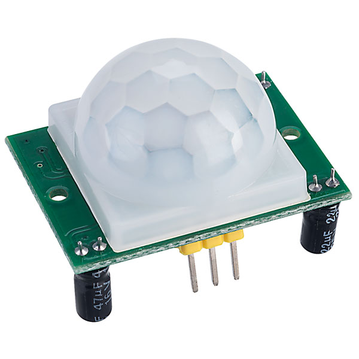
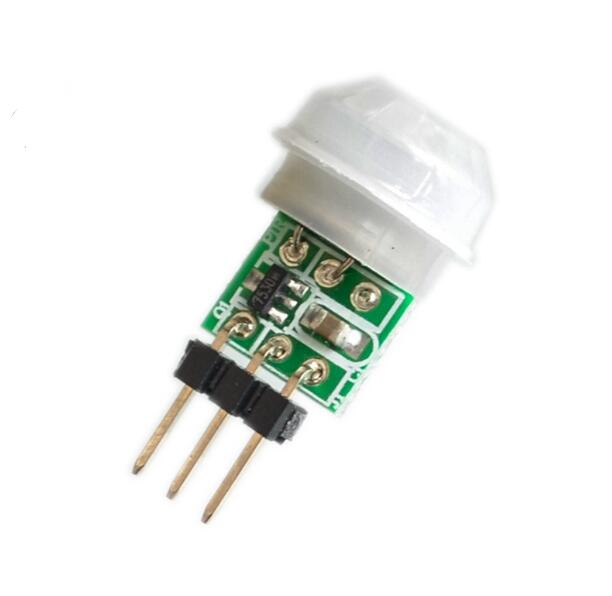

## Sensor PIR HC-SR501 / Arduino Micro PIR AM312

<table border="0" width="100%"><tr><td colspan=2 width="60%">Motion detector</td>
<td rowspan=8 width="40%" align="right"></td></tr>
<tr><td>Voltage range</td><td><b>5.0V - 20V</b></td></tr>
<tr><td>Current consumption</td><td><b>< 50 &microA</b></td></tr>
<tr><td>Detection angle</td><td><b>< 120°</b></td></tr>
<tr><td>Detection range</td><td><b>approx. 7m</b></td></tr>
<tr><td>Operating temperature range</td><td><b>-15°C to +70°C</b></td></tr>
<tr><td>Dimensions</td><td><b>32x24x24 mm</b></td></tr>
<tr><td>Price</td><td><b>< 100 Kč</b></td></tr></table>

* [Datasheet](./datasheet.pdf)

### Circuit
<p align="center"></p>

### MicroPython

```python

```

### References
> https://drive.google.com/file/d/0B4B30jzMyzG8Q2J0eXhsVnliQUE/view