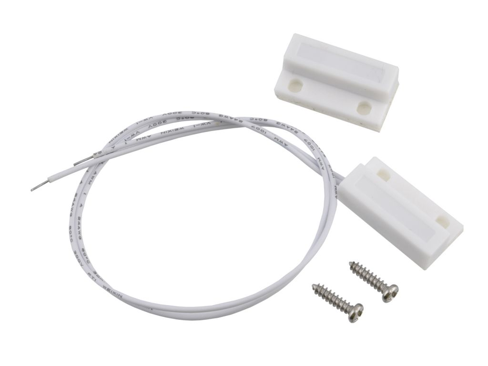

## Sensor LS-311-B38

<table border="0" width="100%"><tr><td colspan=2 width="60%">Reed magnetic sensor</td>
<td rowspan=8 width="40%" align="right"></td></tr>

<tr><td>Price</td><td><b>< 100 Kč</b></td></tr></table>

* [Datasheet](./datasheet.pdf)

### Circuit
<p align="center"></p>

### MicroPython

```python

```

### References
> https://drive.google.com/file/d/0B4B30jzMyzG8Q2J0eXhsVnliQUE/view