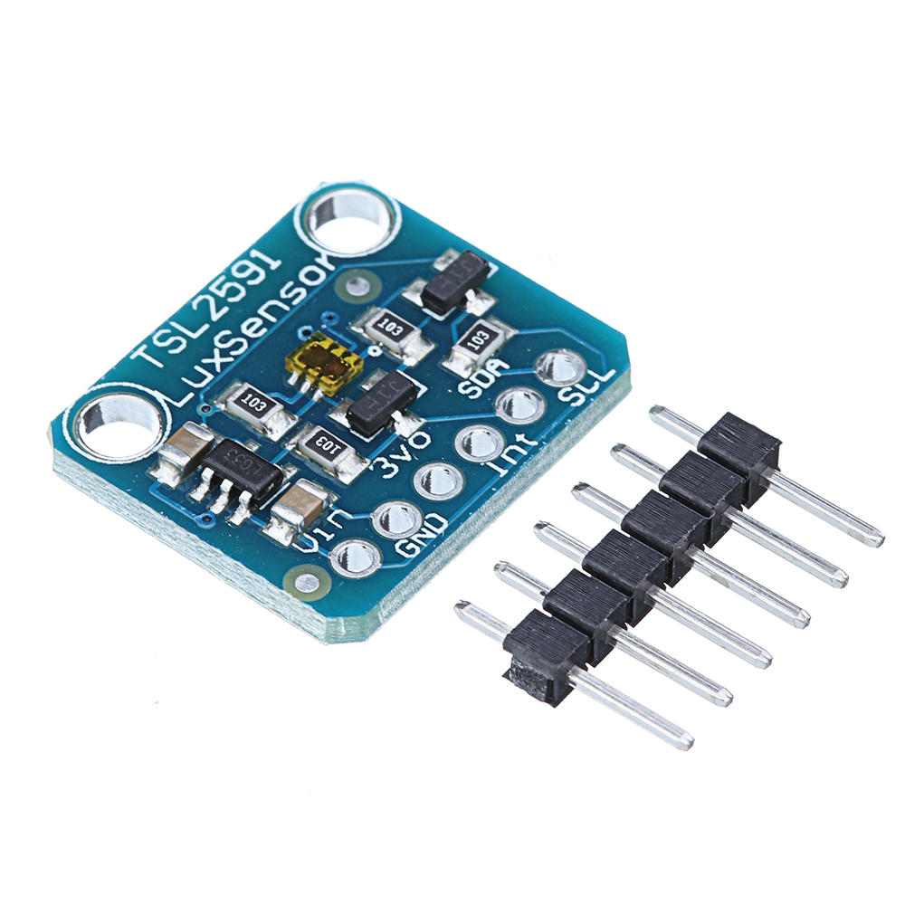
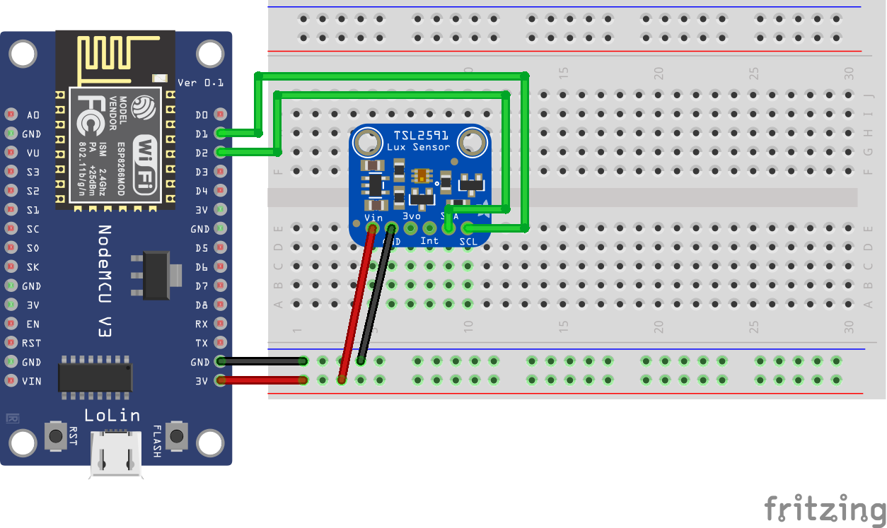

## Sensor TSL2591

<table border="0" width="100%"><tr><td colspan=2 width="60%">Luminosity</td>
<td rowspan=9 width="40%" align="right"></td></tr>
<tr><td>Voltage range</td><td><b>2.7V - 3.6V</b></td></tr>
<tr><td>Price</td><td><b>< 300 Kč</b></td></tr>
<tr><td colspan=2>&nbsp</td></tr>
<tr><td colspan=2>&nbsp</td></tr>
<tr><td colspan=2>&nbsp</td></tr>
<tr><td colspan=2>&nbsp</td></tr>
<tr><td colspan=2>&nbsp</td></tr>
<tr><td colspan=2></td></tr></table>

* [Datasheet](./datasheet.pdf)

### Circuit
<p align="center"></p>

### MicroPython

```python
from tsl2591 import Tsl2591

tsl = Tsl2591(scl_pin_nb=5, sda_pin_nb=4)

print('Lum: {}'.format(tsl.sample()))
```

### References
> https://micropython-iot-hackathon.readthedocs.io/en/latest/hardware-assembly.html

> https://github.com/mpi-sws-rse/thingflow-python

> https://cdn-shop.adafruit.com/datasheets/TSL25911_Datasheet_EN_v1.pdf