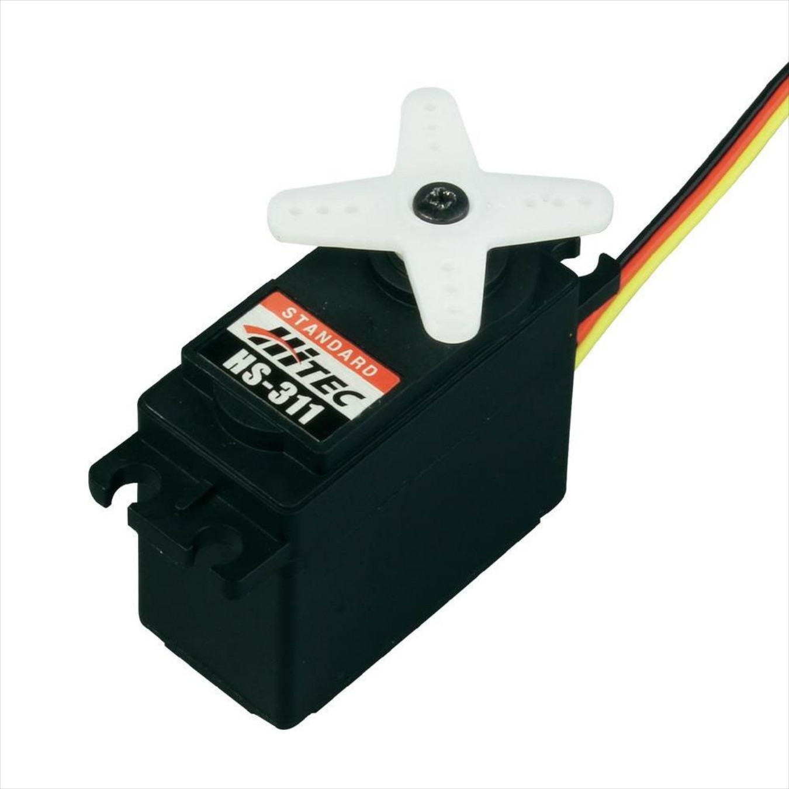
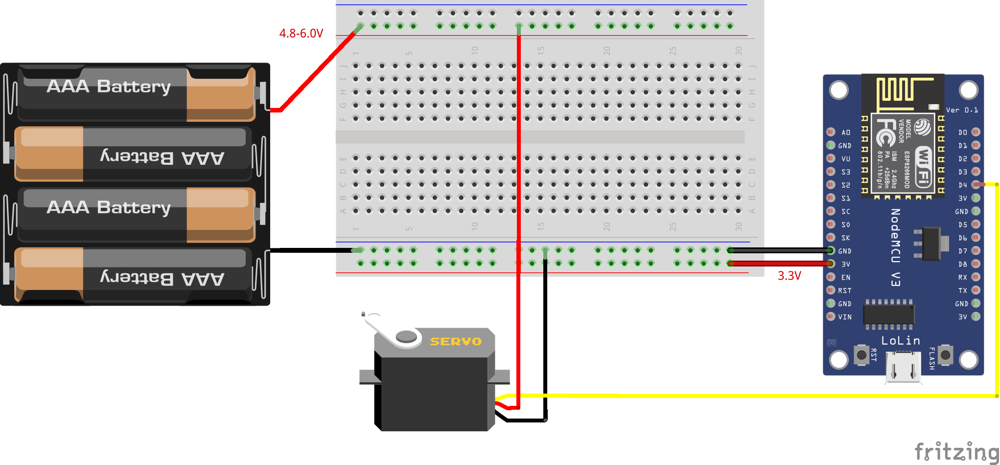

## Servo HS-311 (HiTEC standard)

<table border="0" width="100%"><tr><td width="25%">Voltage range</td><td width="35%"><b>4.8-6.0 V</b></td>
<td rowspan=9 width="40%" align="right"></td></tr>
<tr><td>Max PWM signal range</td><td><b>575-2460 &microsec</b></td></tr>
<tr><td>Pulse cycle</td><td><b>20 ms (Frequency: 50 Hz)</b></td></tr>
<tr><td>Rotational range</td><td><b>180°</b></td></tr>
<tr><td>Speed</td><td><b>4.8V: 0.19 s/60° - 6.0V: 0.15s/60°</b></td></tr>
<tr><td>Weight</td><td><b>43g</b></td></tr>
<tr><td>Dimensions</td><td><b>39.9mm / 19.8 mm / 36.3 mm</b></td></tr>
<tr><td>Operating temperature</td><td><b>-20°C to +60°C</b></td></tr>
<tr><td>Price</td><td><b>< 300 Kč</b></td></tr></table>

* [Datasheet](./datasheet.pdf)

### Circuit
<p align="center"></p>

### MicroPython

```python
from machine import Pin
from servo import Servo

s1 = Servo(pin=Pin(2, Pin.OUT), min_us=575, max_us=2460)
s1.write_angle(degrees=120) # your value, e.g. 120
```

### Notes
> pins currently supported by `machine.PWM`: 0, 2, 4, 5, 12, 13, 14, 15

### References
> https://bitbucket.org/thesheep/micropython-servo/src/default/

> http://www.letmodel.cz/technical-data/serva/hs-311.pdf