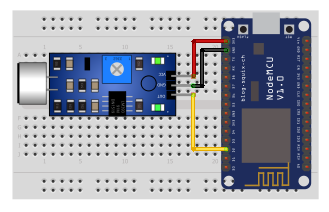

## Sound sensor

<table border="0" width="100%"><tr><td colspan=2 width="60%">seeed studio Grove </td>
<td rowspan=9 width="40%" align="right"></td></tr>
<tr><td>Voltage range</td><td><b>3.5V - 5V</b></td></tr>
<tr><td>Input type</td><td><b>Digital</b></td></tr>
<tr><td>Compatible</td><td><b>Arduino, Raspberry Pi, ESP8266</b></td></tr>
<tr><td>Microphone sensitivity(1kHz)</td><td><b>-60~-56dBV/Pa</b></td></tr>
<tr><td>Microphone Impedance</td><td><b>2.2k Ohm</b></td></tr>
<tr><td>Microphone Frequency</td><td><b>16-20 kHz</b></td></tr>
<tr><td>Microphone S/N Radio</td><td><b>54 dB</b></td></tr>
<tr><td>Response time</td><td><b>1s</b></td></tr>
<tr><td>Price</td><td><b>< 41 Kč</b></td></tr></table>

* [Datasheet](./datasheet.pdf)

### Circuit
<p align="center"></p>

### MicroPython

```python
import machine
import time

sound_pin = machine.Pin(4, machine.Pin.IN)

while True:

    sound_value = sound_pin.value()

    print("Sound value:", sound_value)

    time.sleep(0.1)
```

### Notes
> Also found in Grove Creator Kit-
>
>https://wiki.seeedstudio.com/Grove-Creator-Kit-1/

### References
> https://wiki.seeedstudio.com/Grove-Sound_Sensor/
>
> https://store.arduino.cc/products/grove-sound-sensor

### Zpracováno
- Václav Sontag
- Lucas Löffler